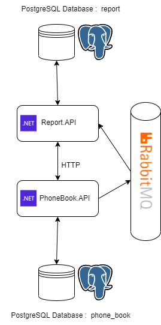
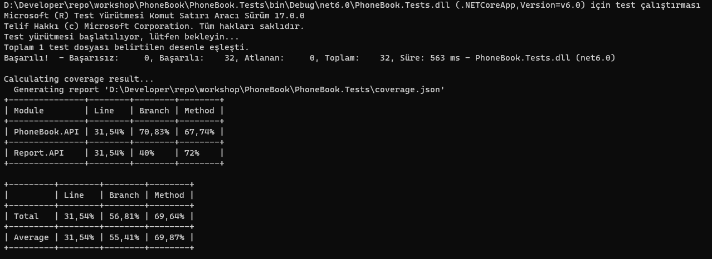

# PhoneBook

Birbirleriyle HTTP ve AMQ protokolleri üzerinden haberleşen iki microservice'in oluşturduğu bir telefon rehberi uygulamasıdır.

> Not: Rise Technology firmasının Back-End Assetment'ıdır.


# Kullanılan Teknolojiler

- [.NET 6](https://docs.microsoft.com/en-us/aspnet/core/introduction-to-aspnet-core?view=aspnetcore-6.0)

- [Entity Framework Core 6](https://docs.microsoft.com/en-us/ef/core/)

- [Docker](https://www.docker.com/)

- [RabbitMQ](https://www.rabbitmq.com/)

- [xUnit](https://xunit.net/)

- [Moq](https://github.com/moq)

- [Coverlet](https://github.com/coverlet-coverage/coverlet)


# Başlarken

1) [**Docker**](https://www.docker.com/)'ın bilgisayarınızda yüklü olduğundan emin olunuz. Ardından aşağıdaki komut ile RabbitMq'u Docker üzerinden çalıştırınız.

```bash
docker run -it --rm --name rabbitmq -p 5672:5672 -p 15672:15672 rabbitmq:3.9-management
```

2. [**PostgreSQL**](https://www.postgresql.org/)'nin bilgisayarınızda yüklü olduğundan emin olunuz. Ardından aşağıdaki adımları uygulayınız.
   1. **PhoneBook.API** içerisinde bulunan **appsettings.json** dosyasındaki **"ConnectionStrings"** içerisinde bulunan **User ID**, **Password** ve **Host** bilgilerini kendinize uygun şekilde düzenleyeniz.
   2. **Report.API** içerisinde bulunan **appsettings.json** dosyasındaki **"ConnectionStrings"** içerisinde bulunan **User ID**, **Password** ve **Host** bilgilerini kendinize uygun şekilde düzenleyeniz.

3. **RabbitMQ** bağlantı bilgisini kendinize göre düzenlemek isterseniz eğer aşağıdaki adımları uygulayınız. 

   1. **PhoneBook.API** içerisinde bulunan **appsettings.json** dosyasındaki **"Options"** içerisinde bulunan **RabbitMqCon** bilgisini kendinize uygun şekilde düzenleyeniz.

      **NOT:** Default ayarlarla kullanmak isterseniz eğer değişiklik yapmanıza gerek yoktur.
   
   2. **Report.API** içerisinde bulunan **appsettings.json** dosyasındaki **"Options"** içerisinde bulunan **RabbitMqCon** bilgisini kendinize uygun şekilde düzenleyeniz.
   
         **NOT:** Default ayarlarla kullanmak isterseniz eğer değişiklik yapmanıza gerek yoktur.
   
4. **PhoneBook.API** için **Report.API** içerisinde bulunan **appsettings.json** dosyasındaki **PhoneBookApiUrl** bilgisini kendinize uygun şekilde düzenleyiniz.
   
5. **Report.API** için **PhoneBook.API** içerisinde bulunan **appsettings.json** dosyasındaki **ReportApiUrl** bilgisini kendinize uygun şekilde düzenleyiniz.

   > **NOT:** Projeler **IIS** üzerinden ayağa kaldırılacaksa eğer **4**. ve **5.** maddelerde değişiklik yapmanıza gerek yoktur.

6.  **PhoneBook.API** klasörü içerisinde bir **terminal** açıp aşağıdaki komut ile **PhoneBook.API** projesini çalıştırabilirsiniz.

   ```bash
   dotnet run
   ```

7. **Report.API** klasörü içerisinde bir **terminal** açıp aşağıdaki komut ile **Report.API** projesini çalıştırabilirsiniz.

      ```bash
      dotnet run
      ```

8. Projeler varsayılan ayarlar ile derlenip, çalıştırıldığında aşağıdaki url'ler üzerinden **swagger** arayüzüne ulaşabilirsiniz.

      ```
      PhoneBook.API Url: https://localhost:7131/swagger/index.html
      Report.API Url   : https://localhost:7047/swagger/index.html
      ```


# Proje Mimarisi Genel Bakış




# Unit Test Code Coverage Sonuçları




